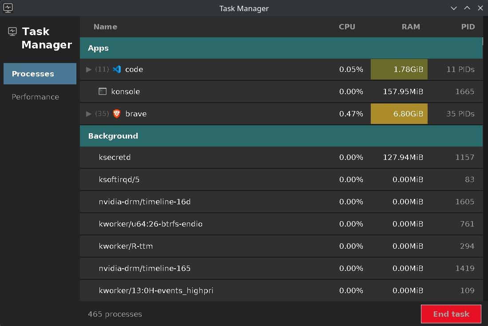
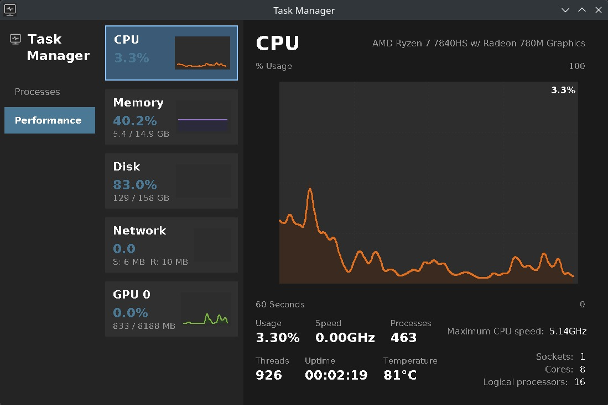
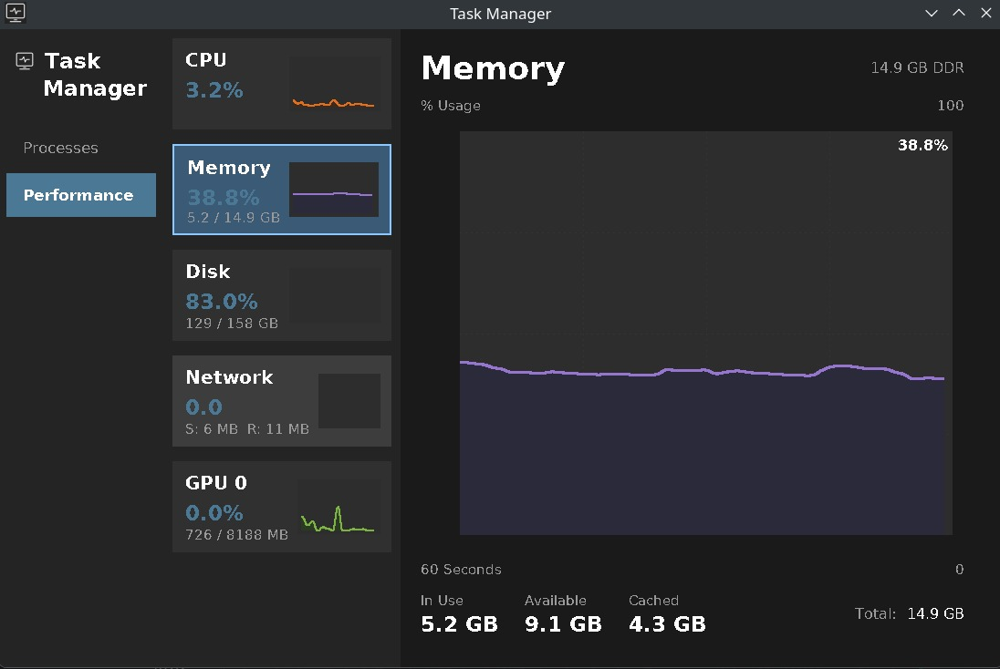
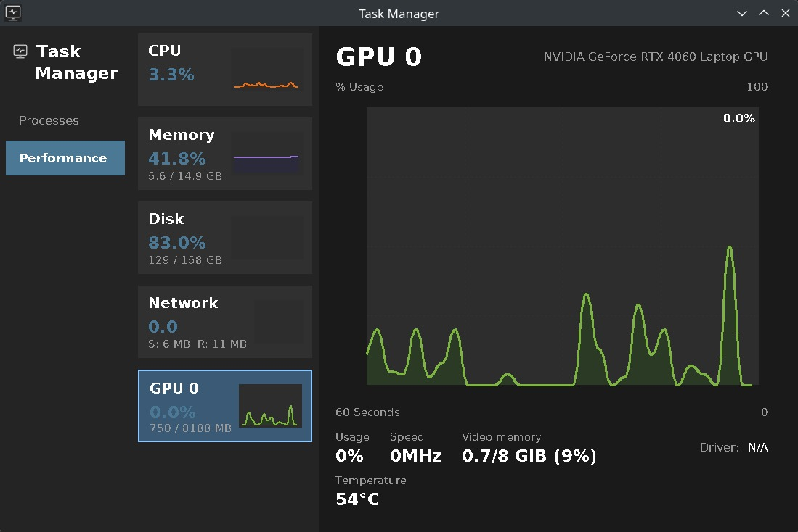

# Task Manager

A Windows Task Manager clone for Linux, built with a C backend and a Python/Tkinter GUI.

## What it does

- Shows running processes split into **Apps** and **Background** sections
- Displays real-time **CPU** and **RAM** usage per process with color-coded cells
- Expandable process groups (e.g. all Chrome processes under one row)
- **Performance tab** with live graphs for CPU, Memory, Disk, Network and GPU
- End task / force kill support with a right-click context menu
- App icons pulled from the system icon themes

## Requirements

- **Python 3.8+**
- **GCC** (to compile the C backend on first run)
- **pip packages:** `psutil`, `Pillow`, `cairosvg`

Install dependencies:

```bash
pip install psutil Pillow cairosvg
```

## Getting started

```bash
git clone https://github.com/NishBaIry/Task-Manager-Clone-Linux.git
cd Task-Manager-Clone-Linux
pip install psutil Pillow cairosvg
python run.py
```

The C backend compiles automatically on the first launch if the binary is missing or the source has changed.

## Install as Linux application

To add Task Manager to your application launcher:

```bash
./install.sh
```

Now you can launch it from your app menu by searching for "Task Manager". To uninstall:

```bash
./uninstall.sh
```

## Project layout

```
run.py                          # Entry point
src/
├── main.py                     # Alternate entry point
├── activity-tracker-white.png  # App icon (white variant)
├── backend/
│   └── task_manager.c          # C backend — reads /proc and nvidia-smi
└── ui/
    ├── main_window.py          # Root window, backend process, update loop
    ├── views/
    │   ├── processes_view.py   # Process list with grouping and icons
    │   └── performance_view.py # CPU / Memory / Disk / Network / GPU panels
    ├── widgets/
    │   ├── graph_widget.py     # Optimised real-time line graph
    │   └── performance_button.py # Sidebar button with mini graph
    ├── themes/
    │   └── theme.py            # Colours, fonts, layout constants
    └── utils/
        └── icon_loader.py      # Loads app icons from .desktop / icon themes
```

## Screenshots

### Process Page


### CPU Performance


### Memory Usage


### GPU Performance

